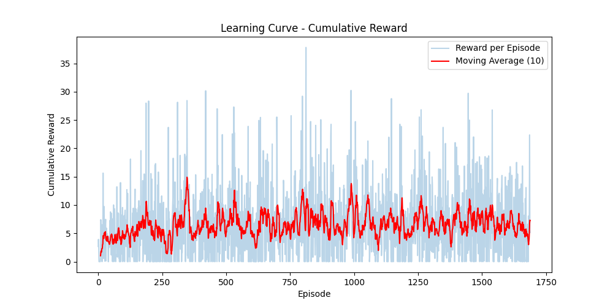
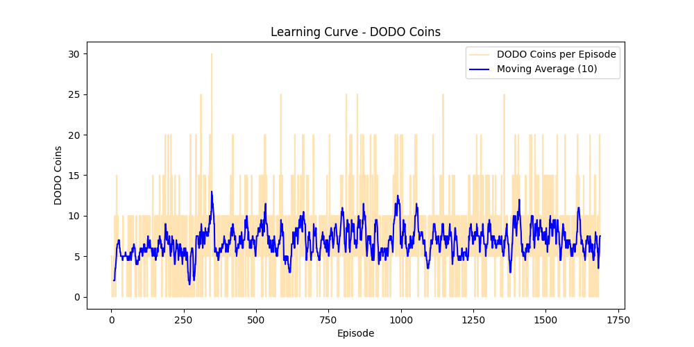
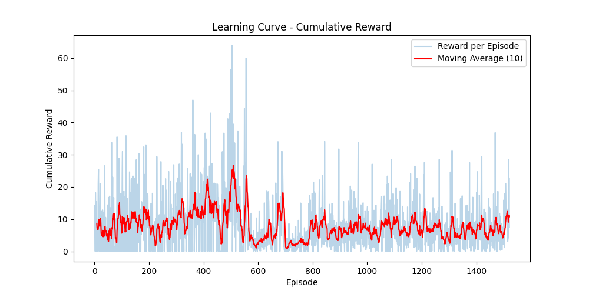
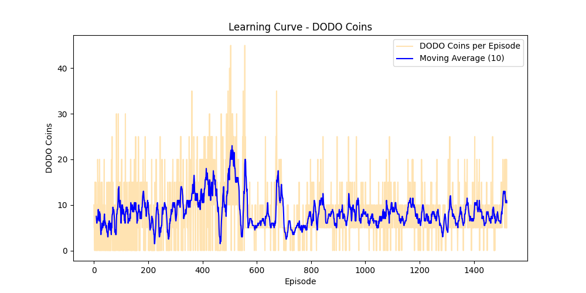
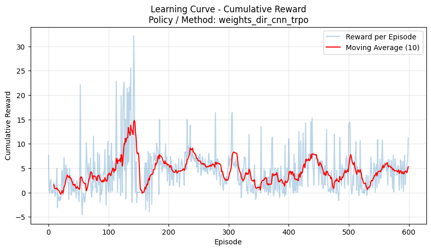
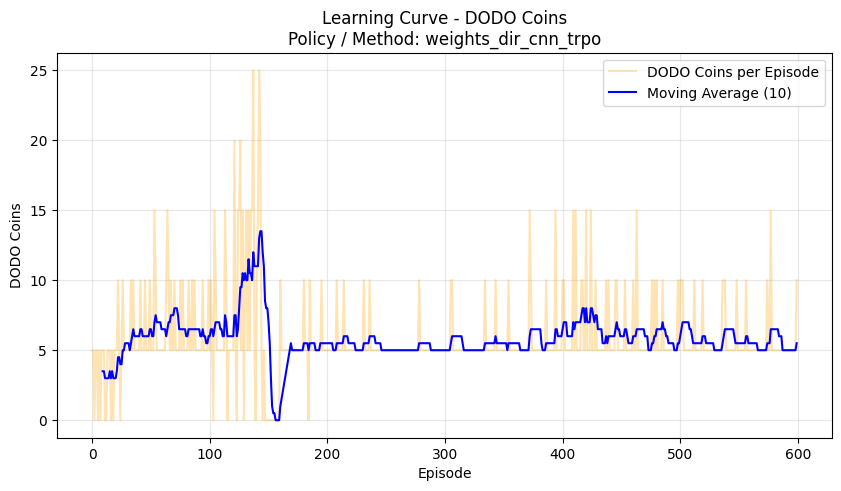
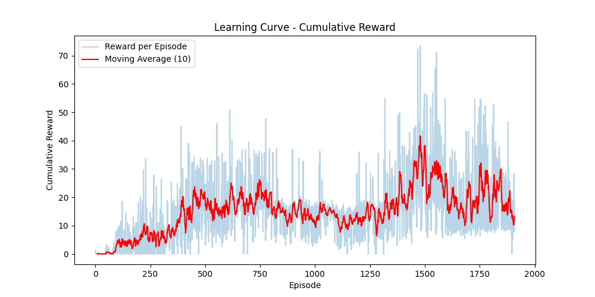
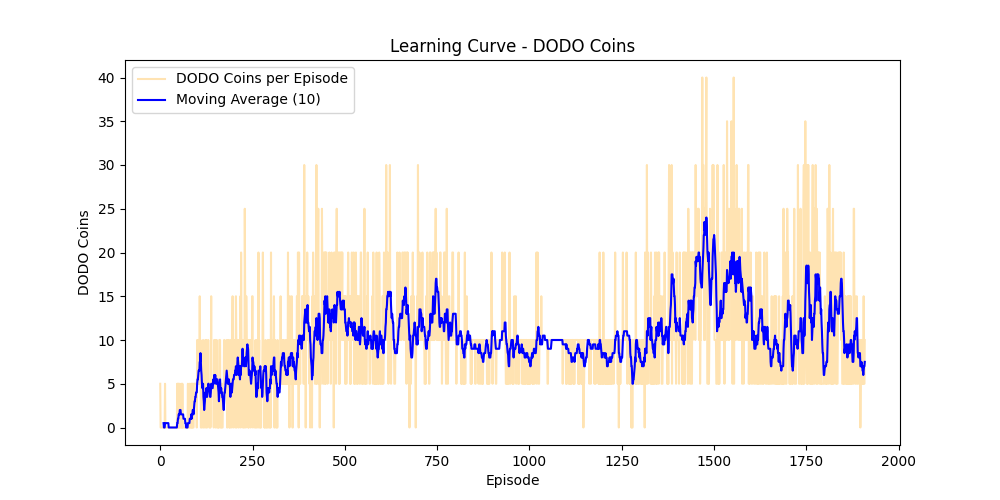

# Reinforcement Learning Project: DODO Simulation

## 1. Problem Definition

### Task Description
The project focuses on training an autonomous Reinforcement Learning agent to play the **DODO Simulation**, a browser-based 3D block-stacking game. The agent interacts directly with a web environment running via Playwright, receiving visual observations (pixels) and sending discrete inputs (mouse clicks) to drop oscillating blocks onto a supporting tower.

### Objective of the Agent
The primary objective of the agent is to maximize the expected cumulative return by continuously stacking blocks directly on top of each other. This entails:
1. Identifying the optimal timing to drop a continuously sliding block onto the static platform below.
2. Building the highest possible tower (maximizing survival time).
3. Maintaining placement precision (maximizing perfectly overlapping area).
4. Collecting in-game DODO coins for sparse bonus rewards.

### Environment Dynamics
The game physics involve blocks that oscillate horizontally across the screen along a single axis at a time, alternating between the X-axis and Z-axis for each new block. When the agent acts (clicks), the current block falls downwards. If it lands on the previous block, the overlapping area between the falling block and the base block becomes the new platform surface for the next round. Any overhanging portion is sliced off and falls away using a Boolean geometric difference. The tower itself also exhibits simulated physical sway based on a multi-body chain simulation.

### Transitions
The core state transitions $p(s_{t+1} \mid s_t, a_t)$ are inherently **deterministic** within the JavaScript engine for a given tick rate. However, from the agent's perspective, the environment is framed as an **MDP with stochastic transitions** due to several factors:
- Asynchronous framerate latency between the Playwright browser and the Python training loop.
- The initial velocity of a newly spawned block is sampled uniformly $v \sim \mathcal{U}[v_{min}, v_{max}]$, with speed scaling up slightly every 10 successful placements.

---

## 2. Environment Specification

### State Representation ($S_t \in \mathcal{S}$)
The state $\mathcal{S}$ is represented by a dual-input observation tensor:
1. **Visual State ($S_t^{vis}$)**: A stack of the previous $N=5$ grayscale rendering frames resized to $84 \times 84$ pixels. This captures the spatial configuration and rate of movement of the block.
2. **Action History ($S_t^{act}$)**: A flat vector representing the last $N=5$ discrete actions $A_{t-N}, \dots, A_{t-1}$ taken by the agent, providing immediate short-term memory of its own control frequency.

### Action Space ($\mathcal{A}$)
The agent operates in a discrete action space with cardinality $|\mathcal{A}| = 2$:
- **0** (Wait): Do nothing. The block continues its horizontal oscillation $x_{t+dt} = x_t + v \cdot dt$.
- **1** (Click): Drop the block. Triggers the boolean slice operation and physically drops the block onto the tower.

### Transition Logic
- If $A_t=0$, the simulation advances by $dt$, and the block translates along its current axis $c \in \{X, Z\}$. The agent remains in the episode.
- If $A_t=1$, the block drops. 
    - If the overlap area $> 0$, the remaining area becomes the new block size, a new block spawns moving along the perpendicular axis, and the camera shifts upwards.
    - If the overlap area $= 0$, the episode flags termination.

### Episode Termination Conditions
An episode formally terminates at step $T$ if any of the following occur:
- **Game Over (Terminal State)**: A dropped block completely misses the platform below ($\frac{\text{New Area}}{\text{Old Area}} = 0$).
- **Time Horizon (Truncation)**: The agent reaches the maximum allowed temporal bounds (`TIME_HORIZON`), artificially ending the episode to prevent infinite loops.

### Full Reward Function ($R_t \sim p^R(\bullet \mid S_t, A_t)$)
The reward function is an event-driven mapping that provides gradients for the policy.

| Event                   | Condition                   | Reward mapping $R_t$                                                      |
| :---------------------- | :-------------------------- | :------------------------------------------------------------------------ |
| **Survival**            | Every physical step $A_t=0$ | $+0.001$                                                                  |
| **Coin Collection**     | Bounding box intersection   | $+R_{coins}$                                                              |
| **Placement Precision** | Successful drop $A_t=1$     | $+R_{area} \times \left( \frac{\text{New Area}}{\text{Old Area}} \right)$ |
| **Game Over**           | Missed drop $A_t=1$         | $-5.0$                                                                    |

---

## 3. History of Agent Evolution

Our development architecture went through the following iterations to stabilize learning:
1. **Iteration 0**: CNN Policy evaluated via REINFORCE, REINFORCE with Baseline, TRPO, PPO. Initial state representation relied solely on the previous 5 visual frames.
2. **Iteration 1**: Added the simplest dense reward of `+0.001` per step for time spent surviving in the game.
3. **Iteration 2**: Introduced sparse conditional rewards correlating with the collection of ingame DODO Coins.
4. **Iteration 3**: Implemented block-precision placement rewards heavily punishing overhangs based on the ratio between the new resulting surface area and the previous old area.
5. **Iteration 4**: Supplemented the neural network's state input to include a vector of the **last 5 discrete actions** taking place alongside the 5 visual frames, dramatically boosting the agent's contextual awareness of its own immediate past decisions.
6. **Iteration 5**: Integrated **Advantage Standardization** across the entire batch (mean-centering and variance normalization) to stabilize gradient updates and added a **Categorical Entropy Bonus** to the loss function to drastically encourage exploration during early training.

---

## 4. Reproducibility

### Exact Commands to Run Training
To run the training loop from scratch using the baseline configuration:
```bash
# Ensure the local game server is running first
python -m http.server 8080

# To train using REINFORCE Baseline Policy
uv run python train.py --policy cnn
```

To resume training from the best checkpoint:
*Set `LOAD_FROM_CHECKPOINT = True` and `LOAD_BEST_WEIGHTS = True` in `rl_config.py`.*
```bash
uv run python train.py
```

### Exact Commands to Evaluate
To evaluate a fully trained agent and render the output without exploring (exploitation only):
```bash
uv run python evaluate.py
```

### Expected Output Description
During training, the script outputs the exact progression of steps and rewards to the active terminal. Upon termination (`Ctrl+C` once), it will output:
- `weights.npy` and `weights_best.npy`: The trained neural network weights.
- `learning_data.json`: The raw history of cumulative rewards and coins collected per episode.
- `learning_curve_reward.png`: Visual plot denoting Moving Average (10) cumulative rewards.
- `learning_curve_dodo_coins.png`: Visual plot denoting Moving Average (10) collected DODO coins.
- `config.json`: Environment hyperparameter snapshot locking the evaluation logic used.

---

## 5. Methodology and Results

### 5.1. REINFORCE

In the REINFORCE algorithm, we directly optimize the policy $\pi$ via a parametrized model $\pi^\theta$ with weights $\theta$. We want to solve an optimal control problem of a Markov Decision Process (MDP) by explicitly maximizing the expected trajectory return:

```math
 v^\pi(s) := \mathbb{E} \left[ \sum_{t=0}^{\tau-1} \gamma^t R_t \mid S_0 = s \right] \to \max_{\pi}, s \in \mathcal{S}
```

With the state-action trajectory defined as $z_t := (s_t, a_t)$, the simplest form of the iterative gradient update rule from iteration $i \in \mathbb{Z}_{\ge 0}$ evaluated for $\tau$ steps follows:

```math
\theta_{i+1} \leftarrow \theta_i + \alpha \sum_{t=0}^{\tau-1} \gamma^t r_t^i \cdot \sum_{t=0}^{\tau-1} \nabla_\theta \ln \pi^\theta (a_t^i \mid s_t^i) 
```

In practice, we estimate this via a batch of sampled episodes. The empirical policy-gradient estimator $\hat{g}$ over a batch of $N$ trajectories becomes:

```math
\hat{g} = \frac{1}{N} \sum_{k=1}^N \left( G(\tau^{(k)}) \right) \sum_{t=0}^{\tau_k-1} \nabla_\theta \ln \pi^\theta(a_t^{(k)} \mid s_t^{(k)}) 
```

And the update rule is structured via gradient ascent:

```math
\theta \leftarrow \theta + \alpha \hat{g} 
```

However, in our evolved execution (Iteration 5), we heavily stabilize the variance of this scalar magnitude via **Advantage Standardization**. Before the gradient evaluates, the individual empirical step returns $G_t^{(k)} = \sum_{t'=t}^{\tau_k-1} \gamma^{t'-t} r_{t'}^{(k)}$ are uniformly standardized against the whole batch to form an advantage-like proxy term:

```math
\hat{A}_t^{(k)} = \frac{G_t^{(k)} - \mu_G}{\sigma_G + \epsilon} 
```

To dramatically encourage exploration during the early random-weight stages of training, a Categorical Entropy bonus $\mathcal{H}$ is appended to the policy loss computation using a scaling coefficient $c$. The true final empirical formula processed in our code follows:

```math
\text{Loss}_{policy} = - \left( \frac{1}{N} \sum_{k=1}^N \sum_{t=0}^{\tau_k-1} \hat{A}_t^{(k)} \cdot \ln \pi^\theta(a_t^{(k)} \mid s_t^{(k)}) \right) - c \cdot \frac{1}{N} \sum_{k=1}^N \sum_{t=0}^{\tau_k-1} \mathcal{H}(\pi^\theta(\bullet \mid s_t^{(k)})) 
```

**Learning Curve (Cumulative Reward & Coins):**





### 5.2. REINFORCE with Baseline

In REINFORCE, we introduce specific control variates to drastically reduce scalar variance in the sample mean. This is known as the baseline mechanism in policy gradient. A baseline $B_t$ is introduced into the expectation like:

```math 
\mathbb{E}_{\pi^\theta} \left[ \sum_{t=0}^{\tau-1} \nabla_\theta \ln \pi^\theta(A_t \mid S_t) \cdot \left( \sum_{k=t}^{\tau-1} \gamma^k R_k - B_t \right) \right] 
```

The requirement on the baseline is that it must be independent of $A_t$ conditioned on $S_t$. Conditional independence allows to factor out $\mathbb{E}[B_t \mid S_t]$ from the inner expectation, whereas the other, remaining, expectation is zero by the token $\int \nabla_\theta \pi^\theta = \nabla_\theta (\int \pi^\theta) = \nabla_\theta (1) = 0$ as in the "don't let the past distract you" trick.

In direct implementation within `agent.py`, rather than utilizing a value estimate Actor-Critic representation $\hat{v}(S_t)$, the baseline $b$ is computed uniformly across the batch using a dynamic Exponential Moving Average (EMA) of explicit step returns to iteratively track the expected aggregate rewards. For an incoming batch of $N$ trajectories, the baseline updates as follows:

```math
b \leftarrow 0.9 b + 0.1 \left( \frac{1}{N} \sum_{k=1}^N \frac{1}{\tau_k} \sum_{t=0}^{\tau_k-1} G_t^{(k)} \right) 
```

Our code uniformly subtracts this moving scalar from all batch returns explicitly via a centered difference $A_t^{(k)} = G_t^{(k)} - b$. The resulting policy-gradient estimator becomes:

```math
\hat{g} = \frac{1}{N} \sum_{k=1}^N \sum_{t=0}^{\tau_k-1} \left( G_t^{(k)} - b \right) \nabla_\theta \ln \pi^\theta(a_t^{(k)} \mid s_t^{(k)}) 
```

Before backpropagation, these advantages are structurally standardized (identically to Iteration 5's naive REINFORCE formulation) and uniformly subtracted by the exact Categorical Entropy modifier to optimize policy loss $\mathcal{L}_{policy}$.

**Learning Curve (Cumulative Reward & Coins):**





## 5.3. TRPO (Trust Region Policy Optimization)

Let $\pi_{\theta_i}$ denote the behavior (old) policy that generated the batch, and let $\pi_{\theta}$ be the updated policy.  
TRPO performs a careful policy update by maximizing a surrogate objective under a trust region constraint.

### Nominal TRPO

A nominal TRPO iteration reads:

```math
\theta_{i+1} = \arg\max_{\theta}\ \hat{L}_{\theta_i}(\theta)
\quad \text{subject to} \quad
\bar{D}_{\mathrm{KL}}\left(\pi_{\theta_i}\ \|\ \pi_{\theta}\right) \le \delta .

```

### Practical surrogate (importance sampling)

The practical TRPO surrogate is:

```math
\hat{L}_{\theta_i}(\theta)
:= \mathbb{E}_{t}\left[
\frac{\pi_{\theta}(A_t \mid S_t)}{\pi_{\theta_i}(A_t \mid S_t)}\ \hat{A}_t
\right],

```

where $\hat{A}_t$ is an advantage estimate computed from the batch (standardized in our implementation).

### How it is solved in our code

In `agent.py`, TRPO is implemented for a categorical policy (discrete actions) using:
- the surrogate loss with ratio $r_t=\exp(\log \pi_{\theta}(A_t \mid S_t)-\log \pi_{\theta_i}(A_t \mid S_t))$;
- Fisher-vector product based on the mean KL divergence;
- **Conjugate Gradient** to compute the step direction;
- step rescaling to satisfy the KL budget (`max_kl`);
- **backtracking line search** until KL is within the trust region and the surrogate improves.

Default TRPO constants in our implementation: `max_kl=1e-2`, `cg_damping=1e-2`, `cg_iters=10`, `backtrack_coeff=0.8`, `backtrack_iters=10`.


### Learning Curve (Cumulative Reward & Coins):





## 5.4. PPO (Proximal Policy Optimization)

PPO is a practical variant of TRPO that replaces explicit KL constraints with a clipped surrogate objective.

Let $\pi_{\text{old}}$ be the behavior policy that generated the batch and $\pi_{\text{new}}$ be the updated policy.  
Define the policy ratio:


```math
r_t := \frac{\pi_{\text{new}}(A_t \mid S_t)}{\pi_{\text{old}}(A_t \mid S_t)} .

```

### PPO clipped surrogate

The PPO clipped objective is:


```math
\hat{L}_{\mathrm{CLIP}}
:= \mathbb{E}_{t}\left[
\min\left(
r_t\,\hat{A}_t,\ \mathrm{clip}(r_t,1-\varepsilon,1+\varepsilon)\,\hat{A}_t
\right)
\right].

```

### How it is implemented in our code

In `agent.py`, PPO:
- stores $\log \pi_{\text{old}}(A_t \mid S_t)$ from the rollout and recomputes $\log \pi_{\text{new}}(A_t \mid S_t)$ during updates;
- forms the ratio via `ratio = exp(logp_new - logp_old)` and applies clipping with `PPO_CLIP_EPS`;
- performs multiple epochs over the same batch (`PPO_EPOCHS`) with minibatches (`PPO_MINIBATCH_SIZE`);
- optionally adds entropy bonus (`PPO_ENTROPY_COEF`) and uses gradient clipping (`PPO_MAX_GRAD_NORM`).

All PPO hyperparameters are set in `rl_config.py`.

### Learning Curve (Cumulative Reward & Coins):





**Qualitative Demonstration:**


### 6. Analysis of Results

Based on the empirical evaluations and learning curves across the implemented algorithms, several key conclusions can be drawn:

1. **Dominance of PPO:** The results clearly indicate that Proximal Policy Optimization (PPO) performs the best for this simulation. Its clipped surrogate objective allowed for stable, monotonic policy improvements without the crippling variance observed in REINFORCE, and it executed much easier and more efficiently compared to the complex Fisher-vector product computations required by TRPO.
2. **Crucial Role of the Entropy Bonus:** We observed that adding a categorical entropy bonus to the policy loss is sometimes the only mechanism that "saves" the entire training process. Without it, the agent's policy would frequently collapse prematurely into suboptimal deterministic behaviors (e.g., never clicking to avoid the game-over penalty), trapping the model in local minima early in training.
3. **Importance of Past Action History:** The environment demonstrated that there are specific tasks where providing the agent's actions from previous time steps ($S_{act}$) is crucial. In highly timing-dependent tracking challenges, visual frames alone may omit subtle kinetic context due to framerate latency; embedding the consecutive history of the last $N$ actions provides the agent with an explicit short-term proprioceptive memory, drastically improving its placement precision and decision-making over time.